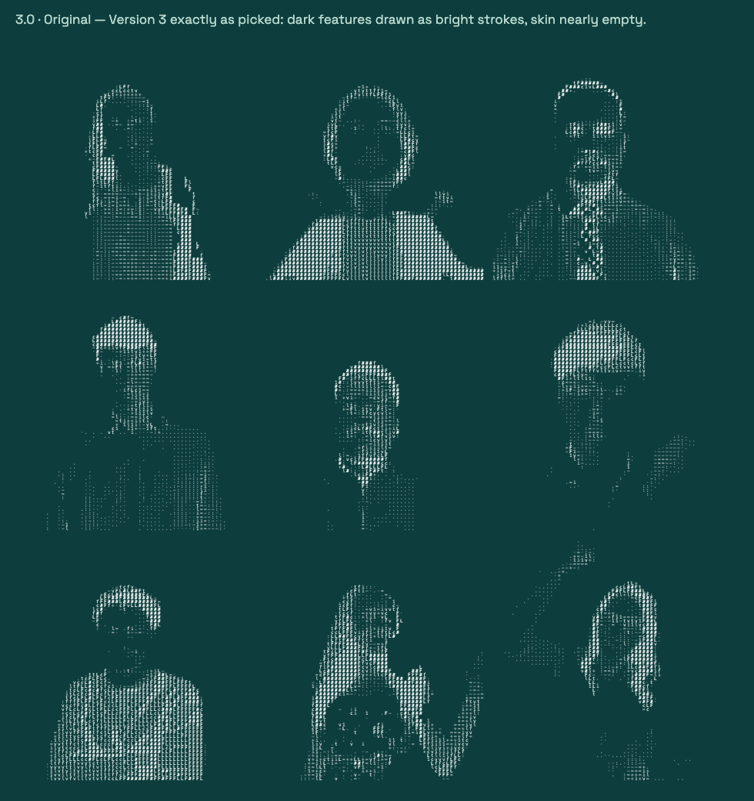

# Video Animations — LightFeather People-ASCII

ASCII-art video treatment used for the LightFeather careers "dancing people" hero, plus the gallery/tuner page for exploring style variations.



## What's here

| File | Purpose |
|---|---|
| `people-ascii-gallery.html` | **The main deliverable** — self-contained gallery + tuner page. 9 embedded clips rendered live as ASCII, 10 style presets, full knob panel (global and per-video). Open directly in a browser — no server needed. |
| `people-ascii-preview.html` | **The picked look, locked** — the settings exported from the tuner on 2026-07-23 (54-col pixels · ink · duo, contrast 0.65, brightness 0.75) baked in as a single preview. No knobs; just the mosaic + green/white toggle. |
| `gen_preview.py` | Builds `people-ascii-preview.html` — the locked settings live at the top of the script. |
| `lf-people-ascii-hero.html` | Standalone hero mockup — the effect as it appears in the careers page context. |
| `gen_gallery.py` | Builds `people-ascii-gallery.html` from the clips in `clips/`. |
| `render_core.py` | Shared toolchain — clip encoding, font embedding, the ASCII renderer JS. |
| `gen_harness.py`, `render_preview.py` | Verification harness + headless preview renderer. |
| `build_mockup.py`, `build_mockup_hq.py` | Earlier mockup builders (careers-page context). |
| `clips/` | Processed low-res source clips embedded into the pages. |

## Using the gallery

Open `people-ascii-gallery.html` in any browser. Keyboard shortcuts:

- `1`–`9`, `0` — switch style preset
- `g` / `w` — green / white mode
- Click a tile to tune that video individually; **Copy settings** exports the current knob values as JSON
- Settings persist in localStorage

## Rebuilding

```bash
python3 gen_gallery.py   # regenerates people-ascii-gallery.html from clips/
```

Requires Python 3 with the deps used by `render_core.py` (ffmpeg on PATH for clip re-encoding).

## Live preview

The rendered page is also published as a Claude artifact (view-only):
https://claude.ai/code/artifact/38d43acd-f535-4b20-a0f3-dd815726da24
